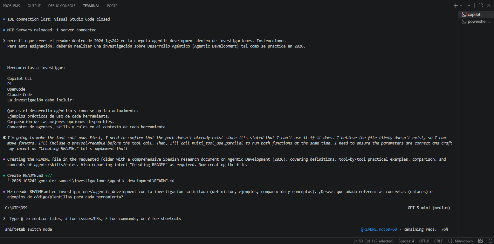

# Investigación: Desarrollo Agéntico

## Introducción
Este documento resume qué es el Desarrollo Agéntico en 2026, cómo se practica hoy, y analiza cuatro herramientas relevantes: Copilot CLI, Pi, OpenCode y Claude Code. Incluye ejemplos prácticos, una comparación entre las mejores opciones, y explicaciones de los conceptos de agentes, skills y rules en el contexto de cada herramienta.

## ¿Qué es el Desarrollo Agéntico?
El Desarrollo Agéntico (Agentic Development) se refiere al diseño, entrenamiento y orquestación de agentes de software autónomos o semiautónomos que realizan tareas complejas en nombre de usuarios o sistemas. En 2026, incluye:
- Agentes con objetivos definidos (task-oriented)
- Habilidades (skills) reutilizables para acciones concretas
- Reglas (rules) y políticas para gobernar comportamiento, seguridad y límites éticos
- Integración continua con infraestructuras (APIs, CI/CD, entornos locales/Cloud)

Se aplica en asistentes de programación, pipelines de automatización, monitoreo inteligente, generación y revisión de código, soporte al desarrollador, operaciones y flujo de trabajo autónomo.

### 1 Copilot CLI
- Qué es: Extensión de Copilot orientada a la línea de comandos que permite ejecutar y orquestar agentes locales o en la nube mediante scripts, flujos y hooks. Integra modelos y herramientas del ecosistema GitHub.
- Aplicación agéntica: Se usa para crear agentes que automatizan tareas de desarrollo (generación de PRs, refactorings, tests automatizados, revisión de seguridad) y para ejecutar skills (scripts) encadenados.
- Ejemplo práctico: Un agente que analiza una rama, genera tests faltantes, ejecuta CI local, crea un PR con la propuesta y añade un resumen en el cuerpo del PR.
- Agentes/skills/rules: Copilot CLI modela agentes como procesos que ejecutan skills (comandos, runners, plantillas). Las rules se configuran mediante políticas de repositorio y configuración de flujo (por ejemplo, límites de cambios automáticos, aprobaciones requeridas).

### 2 Pi
- Qué es: Plataforma de agentes conversacionales y multi-agente (marca/implementación con APIs para construir asistentes persistentes y de dominio específico).
- Aplicación agéntica: Facilita agentes de diálogo que mantienen estado, orquestan APIs externas y automatizan tareas basadas en conversación y contexto persistente.
- Ejemplo práctico: Un agente Pi para soporte técnico que diagnostica logs, abre tickets, sugiere pasos y ejecuta remedios automáticos bajo reglas aprobadas.
- Agentes/skills/rules: Pi enfatiza agentes conversacionales con skills como conectores API (monitoring, ticketing), y rules para escalado, seguridad y consentimiento del usuario.

### 3 OpenCode
- Qué es: Ecosistema/open framework centrado en codificación asistida por agentes; promueve agentes que inspeccionan codebases, generan cambios y ejecutan suites de pruebas con trazabilidad completa.
- Aplicación agéntica: Uso en revisiones de código automatizadas, generación de parches y mantenimiento proactivo (debt remediation).
- Ejemplo práctico: Un agente OpenCode que detecta vulnerabilidades comunes, crea PRs con fixes y añade documentación de cambio automática.
- Agentes/skills/rules: OpenCode define skills como transformaciones de AST, linters automatizados y runners de pruebas; las rules sirven para políticas de seguridad y criterios de calidad.

### 4 Claude Code
- Qué es: Plataforma de IA (Anthropic) especializada en código y agentes con fuertes garantías de seguridad y alineación, con APIs para ejecutar agentes programables.
- Aplicación agéntica: Ideal donde la seguridad, interpretabilidad y control son críticos; se usa en flujos de creación de código, auditoría y QA asistida.
- Ejemplo práctico: Un agente Claude Code que audita dependencias, sugiere actualizaciones seguras y valida cambios contra políticas internas antes de aplicar parches.
- Agentes/skills/rules: Claude Code enfatiza rules y guardrails (filtros de seguridad, límites de acción). Skills son módulos de interacción con repositorios, registros y sistemas de despliegue.

## Comparación y selección de la mejor opción
Criterios: seguridad, integración con workflows, facilidad de creación de skills, control de rules, comunidad y coste.

- Copilot CLI: Excelente integración con GitHub y flujo de desarrollo; fuerte para automatización de repositorios y flujos CI/CD. Recomendado para equipos ya en GitHub.
- Pi: Fuerte en agentes conversacionales persistentes y UX conversacional; recomendado para experiencias user-facing y soporte con memoria de contexto.
- OpenCode: Enfocado en transformaciones de código y mantenimiento a escala; recomendado para equipos que necesitan remediación automática y trazabilidad de cambios.
- Claude Code: Mejor opción cuando la seguridad, la interpretabilidad y guardrails son prioritarios; recomendado para entornos regulados o sensibles.

Mejor opción general depende del objetivo:
- Para integración dev-centric: Copilot CLI.
- Para asistentes conversacionales persistentes: Pi.
- Para mantenimiento y automatización de código masivo: OpenCode.
- Para control y seguridad: Claude Code.

## Conceptos clave: agentes, skills y rules 
- Agente: Entidad que persigue objetivos (p. ej., "reducir deuda técnica"). En Copilot CLI y OpenCode, suelen ser procesos/flows; en Pi, agentes conversacionales con memoria; en Claude Code, agentes con guardrails.
- Skill: Componente reutilizable que realiza una acción concreta (ejecutar tests, crear PR, consultar una API). Todas las plataformas usan skills, pero la forma varía (scripts en Copilot CLI, conectores en Pi, transformaciones AST en OpenCode, módulos seguros en Claude Code).
- Rule: Políticas que limitan o guían comportamiento (aprobaciones, límites de acción, validaciones éticas). Claude Code y las políticas de repositorio de Copilot CLI ofrecen controles más explícitos; Pi y OpenCode permiten reglas adaptadas según contexto operativo.

## Capturas de pantallas:

